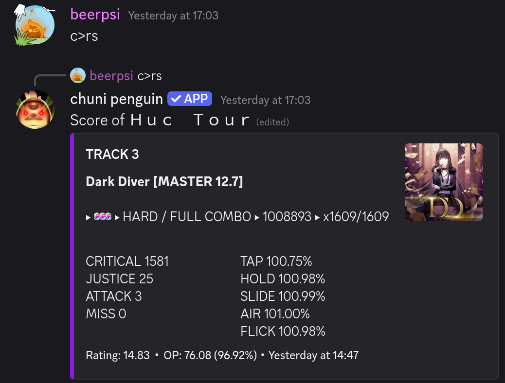
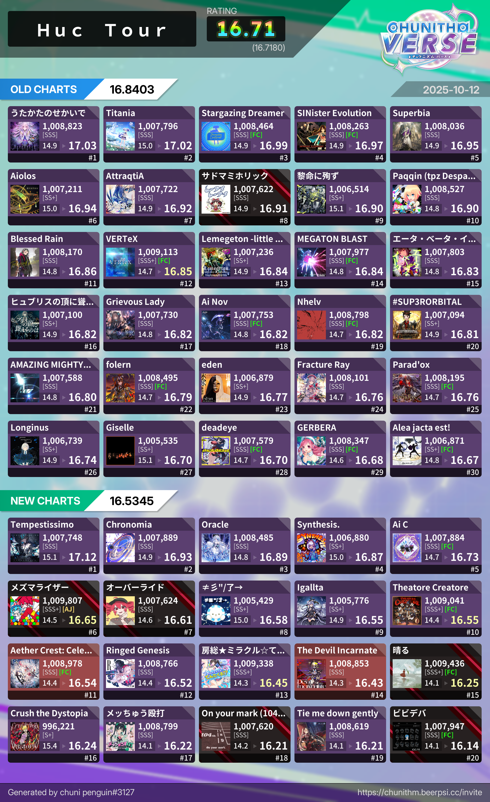
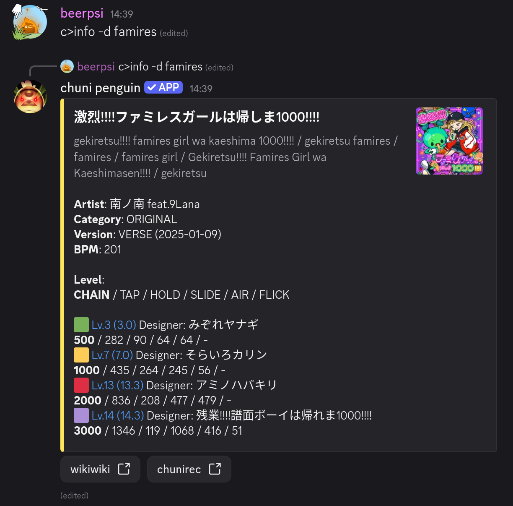
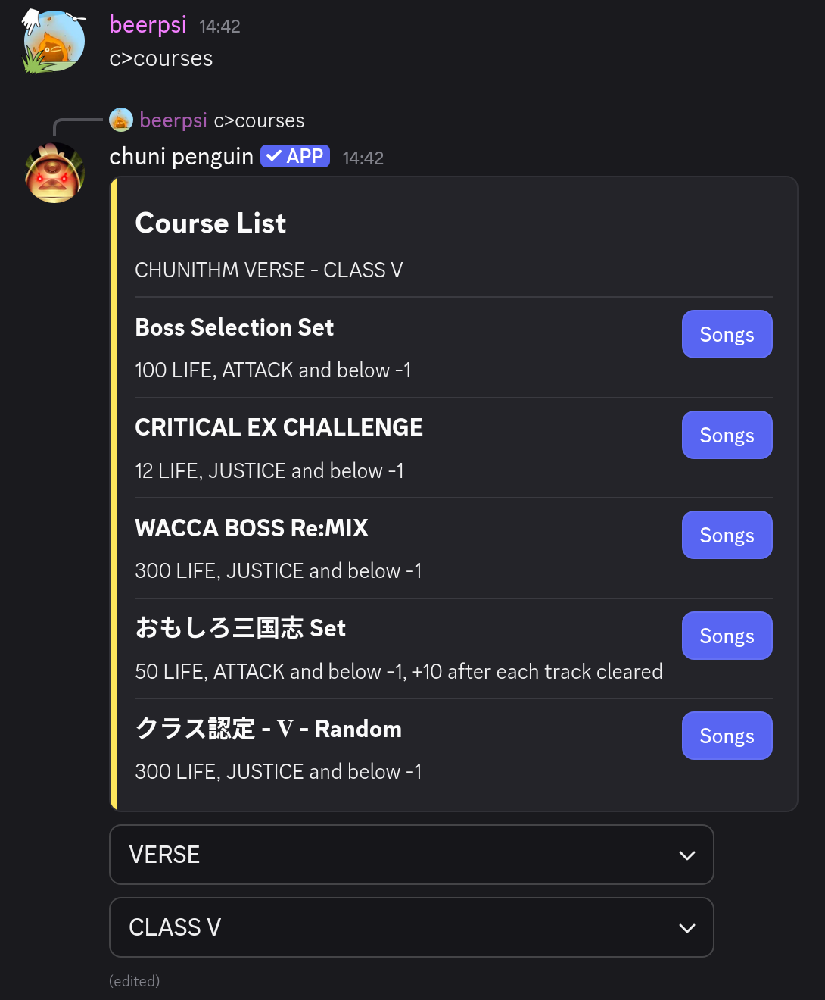
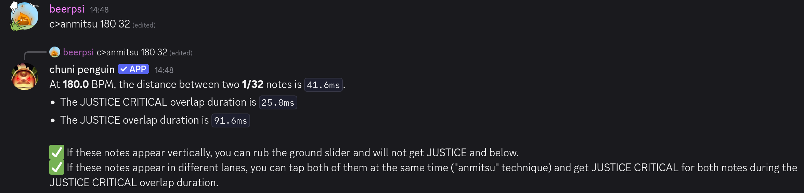
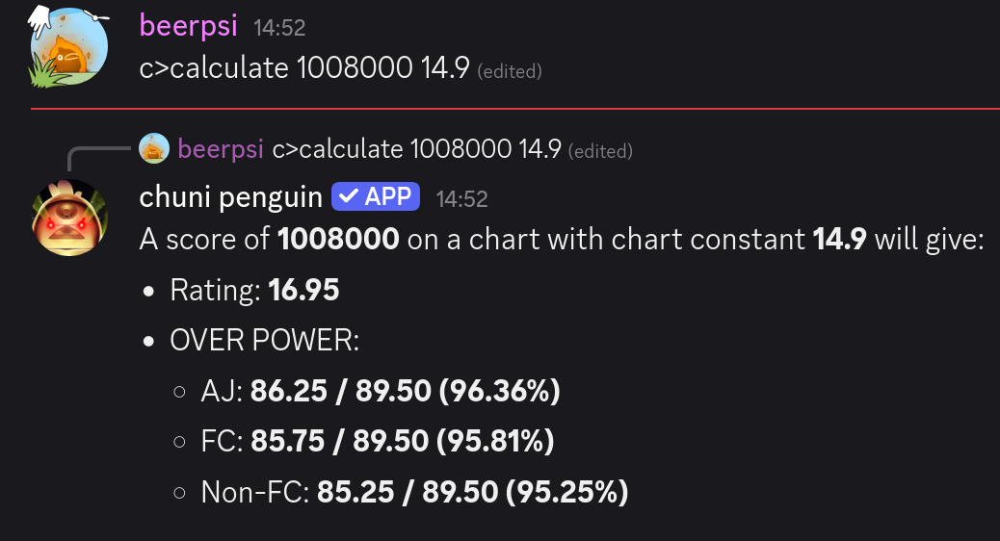
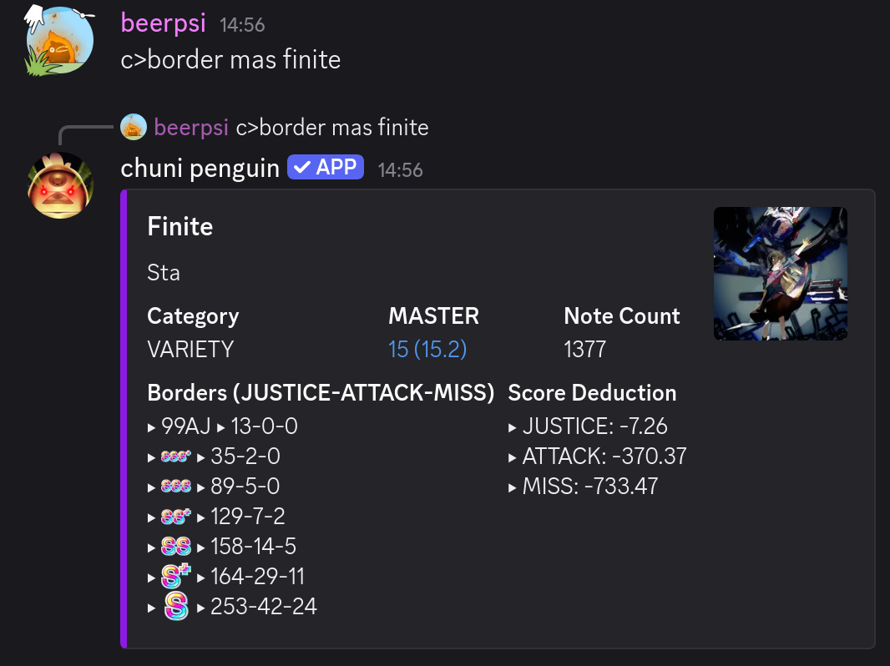
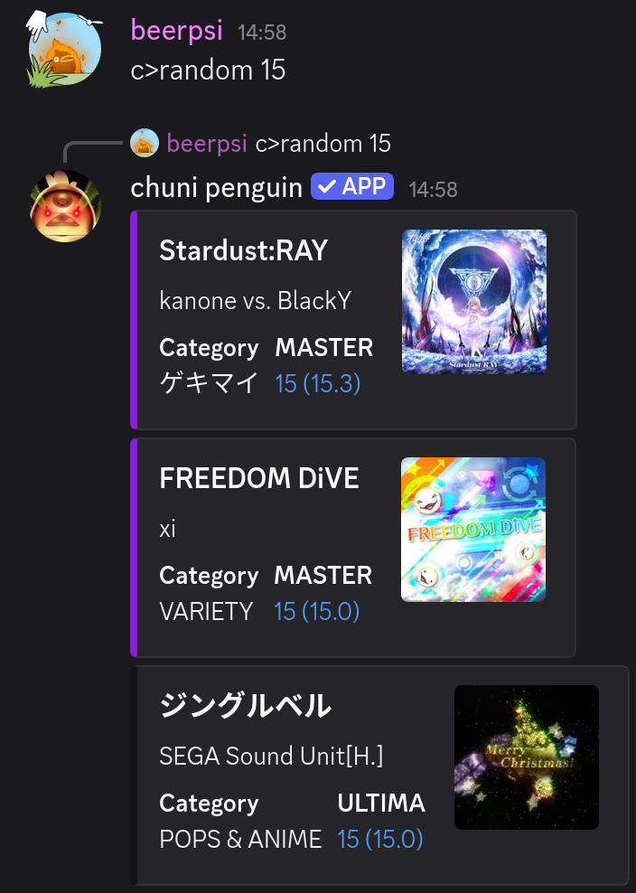
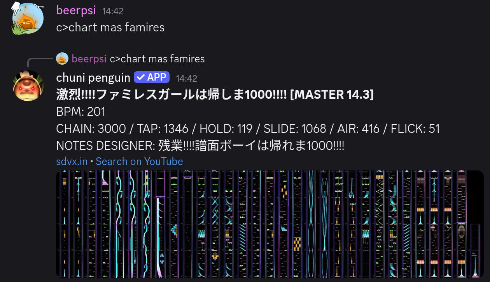
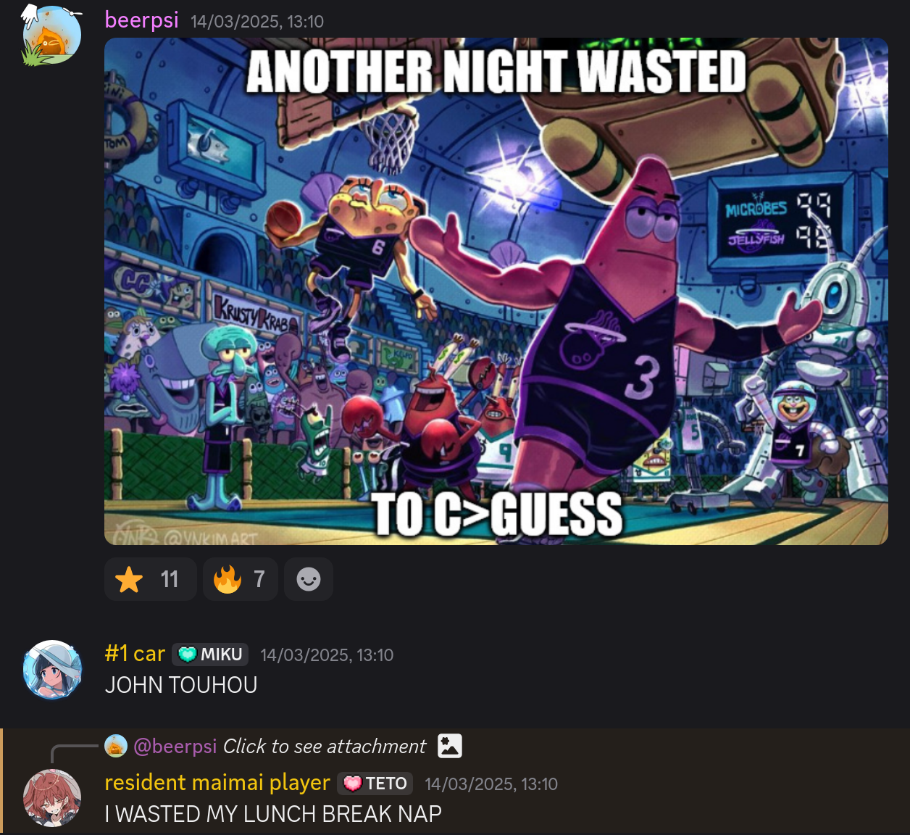

# chuni penguin

chuni penguin is a [Discord](https://discord.com) bot for
[CHUNITHM International version](https://chunithm.sega.com).

[Invite the bot!](https://chunithm.beerpsi.cc/invite)

## Share your scores

Quickly share your scores in Discord. Show your top scores in a beautiful image
breakdown. No more screenshots!

<figure markdown class="grid">
  

  
</figure>

## Find information quickly

Search for songs, charts and courses. View detailed information about them.

<figure markdown class="grid">
  

  
</figure>

## Useful tools

Many other useful tools are included:

/// caption
[Anmitsu](https://chunithm.org/intermediate/tech/#anmitsu) checker
///

<figure markdown="span">
  

  

  <figcaption>Calculators</figcaption>
</figure>

{: width="40%"}
/// caption
Random chart selection
///

/// caption
Chart view (powered by [sdvx.in](https://sdvx.in/chunithm.html))
///

## Fun and games

Ruin your friendships by playing the jacket art and music guessing minigames!

